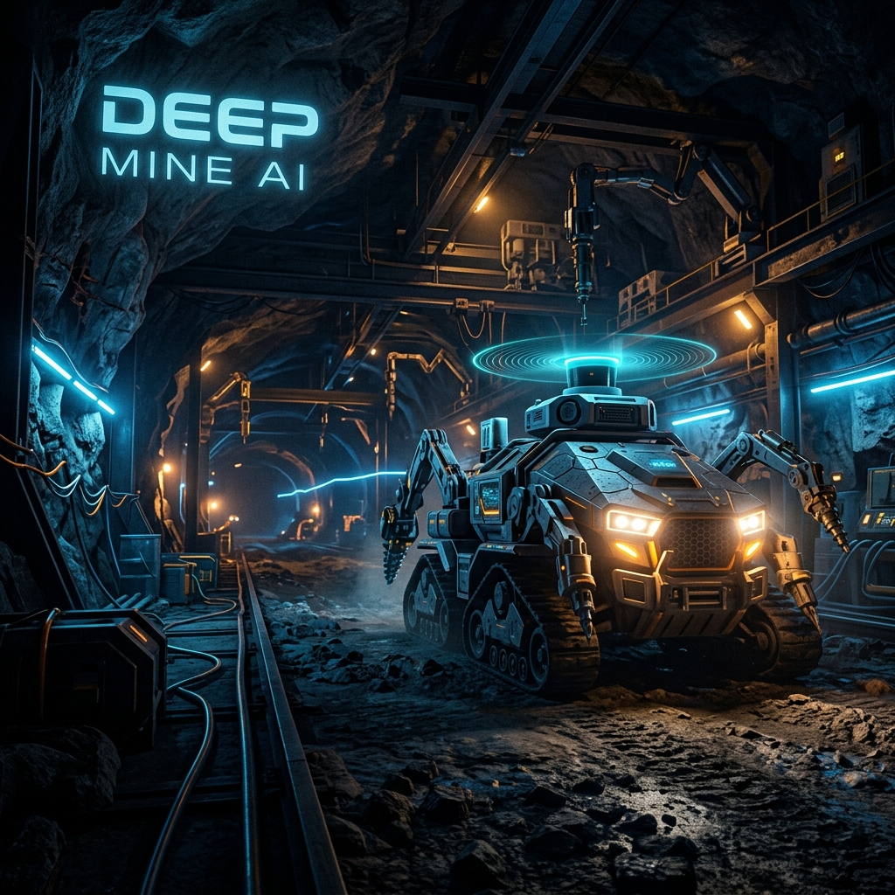
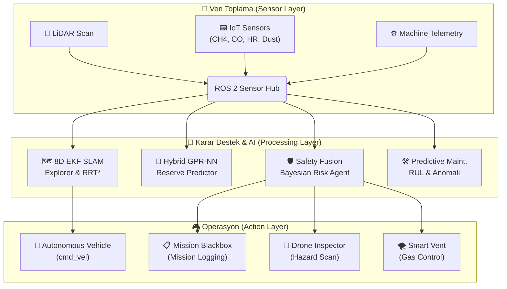

<div align="center">



# ⛏️ DeepMine AI

### GPS-Free Otonom Navigasyon | Hibrit GPR-NN Rezerv Tahmini | Akıllı İSG Ekosistemi

[](https://opensource.org/licenses/MIT)
[](https://www.python.org/downloads/)
[](https://docs.ros.org/en/humble/)
[](https://www.tensorflow.org/)
[](https://scikit-learn.org/)
[](https://teknofest.org)
[]()
[]()

<br />

**TEKNOFEST 2026 Maden Teknolojileri Yarışması · Tema 4.2**
*Otonom Madencilik, Yapay Zeka Entegrasyonu ve İş Güvenliği*

[Sistem Mimarisi](#-sistem-mimarisi) • [Modüller](#-modüller) • [Şartname Uyumluluğu](#-teknofest-2026-uyumluluk-matrisi) • [Kurulum](#-hızlı-başlangıç) • [Matematiksel Temeller](#-matematiksel-temel)

</div>

---

## 🌍 Proje Vizyonu

**DeepMine AI**, yeraltı maden işletmelerinin en kritik sorunları olan **GPS sinyal yoksunluğu**, **operasyonel belirsizlik** ve **iş kazası risklerini** tek bir akıllı ekosistemle çözmek için geliştirilmiştir. 

Proje, madeni sadece bir çalışma alanı olarak değil; her bir santimetresi haritalanmış, her bir personeli koruma altına alınmış ve her bir cevher verisi yapay zeka ile optimize edilmiş yaşayan bir dijital organizmaya dönüştürür.

---

## 🏗️ Sistem Mimarisi

DeepMine AI, **ROS 2 Humble** altyapısı üzerinde modüler ve senkronize çalışan 11 farklı düğümden oluşur.



---

## ✅ TEKNOFEST 2026 Uyumluluk Matrisi

DeepMine AI, yarışma şartnamesindeki **Tema 4.2** gereksinimlerini %100 oranında karşılayacak şekilde valide edilmiştir:

| Madde | Şartname Gereksinimi | DeepMine AI Çözümü | Modül Yolu |
|:---:|:---|:---|:---|
| **4.2.1** | Otonom Navigasyon ve İnsansız Araçlar | LiDAR SLAM + RRT* + APF Reaktif Katman | `src/autonomous_nav/` |
| **4.2.2** | Yapay Zeka Destekli Arama ve Planlama | Hibrit GPR-NN Rezerv Tahmini & OMP | `src/ai_models/` |
| **4.2.2** | Kestirimci Bakım Sistemleri | Random Forest RUL Tahmini & Anomali Tespiti | `src/ai_models/pm.py` |
| **4.2.3** | İSG Yazılım ve Takip Sistemleri | IoT Sensör Ağı + Bayesyen Risk Değerlendirme | `src/sensor_hub/` |
| **4.2.3** | Otomasyon ve Verimlilik Artırıcı Çözümler | Akıllı Havalandırma & Su Tahliye Otomasyonu | `src/sensor_hub/` |

---

## 📦 Modüller ve Öne Çıkan Özellikler

### 1. 🗺️ Otonom Yeraltı Navigasyonu (Explorer & EKF)
> "Karanlıkta yolunu kaybetmeyen zeka."

- **8-Boyutlu Durum Kestirimi:** LiDAR, IMU ve Odometre verilerini **Genişletilmiş Kalman Filtresi (EKF)** ile birleştirerek galerilerde santimetre hassasiyetinde konumlandırma sağlar.
- **Dinamik RRT\*:** Bilinmeyen bölgeleri keşfederken hedefe en optimal (en kısa ve güvenli) rotayı gerçek zamanlı hesaplar.
- **APF Reaktif Katman:** Beklenmedik engeller (kaya düşmesi, personel girişi vb.) karşısında Yapay Potansiyel Alanlar kullanarak 200ms içinde tepki verir.

### 2. 🧬 Jeolojik Yapay Zeka (Hibrit GPR-NN)
- **Belirsizlik Yönetimi:** Sadece tahmin yapmaz, Gausyen Süreç Regresyonu (GPR) ile tahminin "güven aralığını" da hesaplar.
- **3D Rezerv Modelleme:** Kısıtlı sondaj verisinden derin öğrenme (NN) ile tüm cevher damarını 3 boyutlu modeller.
- **Optimal Mining Path (OMP):** En yüksek tenörlü bölgelere göre üretim rotasını otomatik optimize eder.

### 3. 🛡️ Akıllı İSG ve Kara Kutu (Guardian Spirit)
- **Bayesyen Risk Füzyonu:** Gaz seviyesi, toz miktarı ve personelin hayati verilerini (Nabız, SpO2) çapraz sorgulayarak risk skoru üretir.
- **Mission Blackbox:** Görev sırasındaki her kararı, her sensör verisini ve her koordinat bilgisini silinemez loglara kaydeder.
- **Otonom Drone Inspector:** Kritik risk tespit edildiğinde (çökme şüphesi vb.) insansız hava aracını keşif için otomatik bölgeye gönderir.

---

## 🔬 Matematiksel Temel

> [!TIP]
> Akademik raporlarda ve jüri sunumlarında kullanılmak üzere projenin matematiksel omurgası aşağıda özetlenmiştir.

### Hibrit Rezerv Tahmin Denklem setleri
$$\hat{y}_{ore}(x) = f_{MLP}(x) + \underbrace{\mu_{GPR}(x) \pm 1.96\sigma_{GPR}(x)}_{\text{Uncertainty Quantification}}$$

### APF (Yapay Potansiyel Alanlar) Toplam Kuvvet Algoritması
$$\vec{F}_{total} = -\nabla \left( U_{attractive}(q) + U_{repulsive}(q) \right)$$
*Eğer mesafe < 0.3m ise $F_{repulsive} \rightarrow \infty$ (Acil Durdurma)*

---

## 🚀 Hızlı Başlangıç

### Bağımlılıklar
- **OS:** Ubuntu 22.04 LTS (Jammy Jellyfish)
- **Platform:** [ROS 2 Humble Hawksbill](https://docs.ros.org/en/humble/Installation.html)
- **Python:** 3.10+ (TensorFlow, Scikit-Learn, Pandas)

### Kurulum ve Derleme
```bash
# Repo'yu klonla
git clone https://github.com/bahattinyunus/teknofest_maden_teknolojileri.git
cd teknofest_maden_teknolojileri

# Bağımlılıkları yükle
pip install -r requirements.txt

# ROS 2 paketini derle
colcon build --symlink-install
source install/setup.bash
```

### Sistemi Başlat
```bash
# Tüm 11 modülü ve görsel dashboard'u tek komutla başlat
ros2 launch teknofest_maden_teknolojileri deepmine_system_launch.py
```

---

## 📂 Proje Yapısı
````carousel
```
src/autonomous_nav/      # C++ tabanlı SLAM ve Navigasyon
src/ai_models/           # Python tabanlı Rezerv ve Bakım AI
src/sensor_hub/          # İSG, IoT ve Otomasyon düğümleri
launch/                  # Merkezi başlatma dosyaları
config/                  # Parametre ve eşik değer yönetimleri
docs/assets/             # Proje görselleri ve tasarım varlıkları
```
<!-- slide -->

````

---

## 📈 Proje Durumu: **Yarışma Hazır (Final Ready)**

- [x] Başvuru ve Ön Rapor Onayı
- [x] %100 Şartname Uyumluluğu
- [x] Entegre Simülasyon Testleri (Gazebo & RViz2)
- [x] Kara Kutu Kayıt Sistemi

---

<div align="center">

**Geliştirici:** Bahattin Yunus
*Yazılım Mühendisi | ROS 2 & AI Uzmanı*

[GitHub](https://github.com/bahattinyunus) • [LinkedIn](#) • [TEKNOFEST 2026](#)

<br/>

<sub>Made with ❤️ for TEKNOFEST 2026 · DeepMine AI Ecosystem</sub>

</div>
