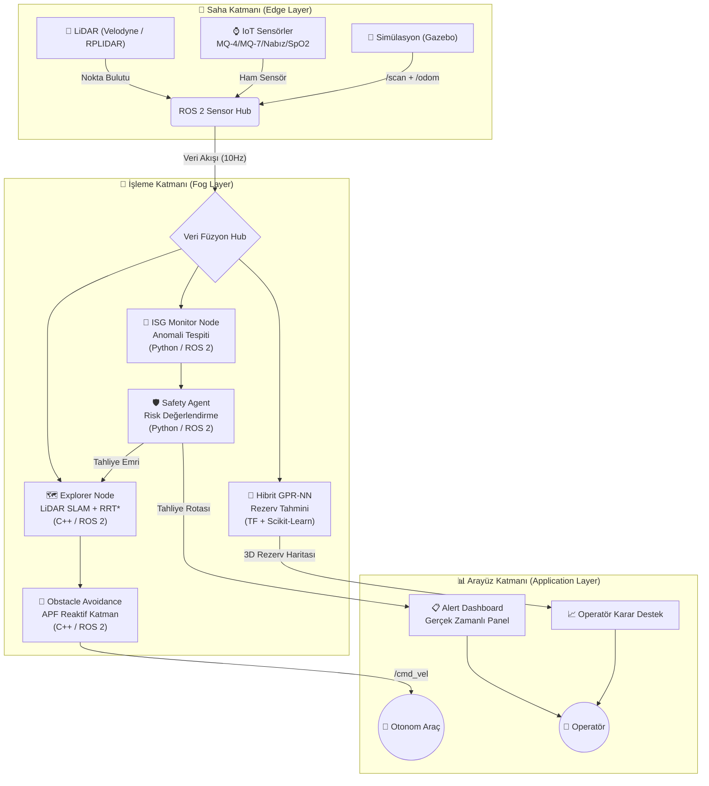

<div align="center">

# ⛏️ DeepMine AI
### GPS-Free Otonom Navigasyon | Hibrit GPR-NN Rezerv Tahmini | Akıllı İSG Sistemi

[](https://opensource.org/licenses/MIT)
[](https://www.python.org/downloads/)
[](https://docs.ros.org/en/humble/)
[](https://www.tensorflow.org/)
[](https://scikit-learn.org/)
[](https://teknofest.org)
[]()

<br />

**Tema 4.2 · Otonom Madencilik, Yapay Zeka Entegrasyonu ve İş Güvenliği**

[Mimari](#-sistem-mimarisi) •
[Modüller](#-modüller) •
[Matematiksel Temel](#-matematiksel-temel) •
[Kurulum](#-kurulum-ve-çalıştırma) •
[TEKNOFEST Yol Haritası](#-teknofest-2026-yol-haritası)

</div>

---

## 🌍 Proje Vizyonu

**DeepMine AI**, TEKNOFEST 2026 Maden Teknolojileri Yarışması şartnamesinin **Tema 4.2: Otonom Madencilik, Yapay Zeka Entegrasyonu ve İş Güvenliği** kapsamında geliştirilen bütünleşik bir yerli teknoloji platformudur.

Proje; üç temel şartname alt başlığını tam olarak karşılar:

| Şartname Alt Başlığı | DeepMine AI Bileşeni | Teknoloji |
|---|---|---|
| **4.2.1** Otonom Navigasyon ve İnsansız Maden Araçları | `Explorer Node` + `Obstacle Avoidance` | LiDAR SLAM, RRT*, APF |
| **4.2.2** Yapay Zeka Destekli Arama ve Planlama | `Hibrit GPR-NN` Rezerv Tahmincisi | TensorFlow, Scikit-Learn, GPR |
| **4.2.3** Akıllı İSG ve Takip Sistemleri | `ISG Monitor` + `Safety Agent` | IoT, ROS 2, Anomali Tespiti |

> *"Geleceğin madenciliği, veriyi altına ve güvenliği zekaya dönüştüren sistemlerde başlar."*

---

## 🏗️ Sistem Mimarisi



---

## 📦 Modüller

### 1. 🗺️ Otonom Navigasyon (`src/autonomous_nav/`)

**Explorer Node** (`explorer_node.cpp`) | **C++ / ROS 2 Humble**

GPS sinyalinin ulaşmadığı yeraltı galerilerinde tam otonom haritalama ve navigasyon sistemi.

- **SLAM**: LiDAR `/scan` verilerini `Bresenham` doğru algoritmasıyla 2D Occupancy Grid haritasına dönüştürür
- **Rota Planlama**: `RRT*` (Rapidly-exploring Random Trees Optimal) ile hedefe en düşük maliyetli yolu bulur
- **Tepki**: Tahliye komutu geldiğinde tüm planlamayı iptal edip güvenli çıkış rotası hesaplar

**Obstacle Avoidance Node** (`obstacle_avoidance.cpp`) | **C++ / ROS 2 Humble**

Dar galerilerde anlık engel kaçınma için reaktif katman.

- **Yapay Potansiyel Alanlar (APF)**: `F_total = F_attractive + F_repulsive`
- Engel ≤ 30cm → Acil durdurma; Engel ≤ 60cm → Yavaşla ve yön değiştir
- RViz2'ye kuvvet vektörü görselleştirmesi yayınlar

---

### 2. 🧬 AI Rezerv Tahmini (`src/ai_models/`)

**Hibrit GPR-NN Sistemi** | **Python / TensorFlow / Scikit-Learn**

Şartname gerekliliği: *"Sondaj verilerini anlık işleyerek 3D cevher modellemesi yapan karar destek yazılımı"*

**Veri Özellikleri (Features):**
- Manyetik anomali (nT), yerçekimi anomalisi (mGal)
- Elektriksel özdirenç (Ω·m), yükleme kapasitesi IP (ms)
- Sismik P-dalgası hızı (m/s), kayaç yoğunluğu (g/cm³)
- Alterasyon indisi, sondaj derinliği (m)

**Desteklenen Jeolojik Bölgeler:**
- `bor_rich` → Bor-zengin tuz gölü havzası (Kırka/Emet tipi)
- `rare_earth` → Nadir toprak elementi yatağı (Kızılcaören tipi)
- `copper_porphyry` → Porfiri bakır yatağı
- `coal` → Linyit kömür yatağı

---

### 3. 🛡️ Akıllı İSG Sistemi (`src/sensor_hub/`)

**ISG Monitor Node** (`isg_monitor_node.py`) | **Python / ROS 2**

Şartname gerekliliği: *"Metan gazı, toz ve sarsıntı takibi yaparak tehlikeli durumları anlık bildiren yerli IoT sensör ağlarının kurulması"*

| Sensör | Uyarı Eşiği | Alarm Eşiği | Kritik Eşik |
|---|---|---|---|
| **CH₄ Metan** | >1% LEL | >2.5% LEL | >5% LEL 💥 |
| **CO** | >25 ppm | >35 ppm | >50 ppm |
| **Nabız** | >100 BPM | >110 BPM | >130 BPM / <45 BPM |
| **SpO₂** | <96% | <94% | <90% |
| **PM2.5 Toz** | >50 µg/m³ | >150 µg/m³ | — |

**Safety Agent** (`safety_agent.py`) | **Python / ROS 2**

Çok personelli risk korelasyon analizi ve otonom tahliye kararı.

- Ağırlıklı risk skoru (0-100): CH₄×35 + CO×25 + SpO₂×20 + HR×10 + Toz×10
- 2+ personel kritik → Sistem geneli tahliye tetiklenir
- Son 60 saniyede 10+ alarm → Otomatik tahliye
- Her personel için tahliye rotası ve tahmini süre hesaplanır

---

## 🔬 Matematiksel Temel

### Gaussian Process Regression (GPR) Çekirdek Fonksiyonu

$$k(x, x') = C \cdot \mathcal{M}_{\nu=2.5}(x, x') + \sigma^2_{noise}$$

Matern ν=2.5 çekirdeği, gerçek jeolojik veriler için RBF'den daha gerçekçidir (C¹ türevlenebilir).

### Hibrit GPR-NN Nihai Tahmin

$$\hat{y}(x) = \underbrace{f_{NN}(x)}_{\text{NN tahmini}} + \underbrace{\mu_{\epsilon}(x)}_{\text{GPR düzeltme}}$$

Belirsizlik: $\sigma(x) = \sigma_{\epsilon}(x)$ → "Bilmiyorum" diyebilen AI

### RRT* Maliyet Optimizasyonu

$$c_{new} = \min_{i \in \text{Near}} \left( c_i + d(x_i, x_{new}) \right)$$

Rewiring ile mevcut ağaç düğümlerinin maliyetini iyileştirir.

### APF Toplam Kuvvet

$$\vec{F}_{total} = \underbrace{k_{att} \cdot \hat{d}_{goal}}_{\text{Çekici}} + \underbrace{k_{rep} \cdot \left(\frac{1}{d} - \frac{1}{d_0}\right) \frac{1}{d^2} \cdot (-\hat{d}_{obs})}_{\text{İtici}}$$

---

## 💻 Kurulum ve Çalıştırma

### Gereksinimler

```
OS       : Ubuntu 22.04 LTS
ROS 2    : Humble Hawksbill
Python   : 3.10+
Derleme  : colcon, ament-cmake
```

### 1. Python Bağımlılıkları

```bash
pip install -r requirements.txt
```

### 2. ROS 2 Workspace Derleme

```bash
# Workspace kökünde
colcon build --symlink-install
source install/setup.bash
```

### 3. Tüm Sistemi Başlat

```bash
ros2 launch teknofest_maden_teknolojileri deepmine_system_launch.py
```

### 4. AI Rezerv Analizi (Bağımsız)

```bash
# Sentetik veri üret + Model eğit + 3D rezerv modelle
python3 src/ai_models/data_generator.py --samples 2000 --region bor_rich
python3 src/ai_models/reserve_predictor.py --predict-3d
python3 src/ai_models/visualizer.py --all
```

### 5. İSG Test Senaryoları

```bash
# Metan sızıntısı senaryosu tetikle
ros2 topic pub /deepmine/isg_scenario std_msgs/msg/String "data: 'gas_leak'"

# Yangın senaryosu
ros2 topic pub /deepmine/isg_scenario std_msgs/msg/String "data: 'fire'"

# Çökme senaryosu
ros2 topic pub /deepmine/isg_scenario std_msgs/msg/String "data: 'collapse'"
```

### 6. Navigasyon Hedefi Gönder

```bash
ros2 topic pub /deepmine/goal geometry_msgs/msg/PoseStamped \
  '{header: {frame_id: "map"}, pose: {position: {x: 25.0, y: 0.0}}}'
```

---

## 📂 Proje Yapısı

```
teknofest_maden_teknolojileri/
├── src/
│   ├── autonomous_nav/                # 🗺️ Otonom Navigasyon (C++)
│   │   ├── include/deepmine_ai/       #     Başlık dosyaları
│   │   └── src/
│   │       ├── explorer_node.cpp      #     LiDAR SLAM + RRT* (GPS-free)
│   │       └── obstacle_avoidance.cpp #     APF Reaktif Engel Kaçınma
│   ├── ai_models/                     # 🧬 Yapay Zeka Modelleri (Python)
│   │   ├── data_generator.py          #     Sentetik jeofizik veri üretici
│   │   ├── reserve_predictor.py       #     Hibrit GPR-NN rezerv tahmincisi
│   │   └── visualizer.py              #     3D harita + İSG dashboard görsel
│   └── sensor_hub/                    # ⌚ İSG ve Sensör Sistemi (Python)
│       ├── isg_monitor_node.py        #     IoT sensör ağı izleme (10Hz)
│       ├── safety_agent.py            #     Otonom risk değerlendirme ajanı
│       └── alert_dashboard.py         #     Gerçek zamanlı terminal paneli
├── launch/
│   └── deepmine_system_launch.py      # 🚀 Tüm sistemi başlatan launch dosyası
├── config/
│   └── deepmine_params.yaml           # ⚙️ Merkezi parametre konfigürasyonu
├── simulation/
│   └── mine_gallery.sdf               # 🎮 Gazebo yer altı galeri dünyası
├── docs/                              # 📚 Teknik raporlar ve görseller
├── CMakeLists.txt                     # ROS 2 derleme konfigürasyonu
├── package.xml                        # ROS 2 paket tanımı
└── requirements.txt                   # Python bağımlılıkları
```

---

## 🎭 Operasyonel Senaryolar

### Senaryo A: Tam Otonom Keşif (The Ghost Explorer)
Araç bilinmeyen bir galeriye bırakılır. LiDAR SLAM ile kendi haritasını çıkarır, RRT* ile hedefe ulaşır. `Obstacle Avoidance` beklenmedik engelleri APF ile aşar.

### Senaryo B: Gaz Sızıntısı Tahliyesi (The Guardian Spirit)
Metan seviyesi kritik eşiği aştığında: `ISG Monitor` → `Safety Agent` → Tahliye Emri → `Explorer Node` → Tüm otonom araçlar güvenli çıkışa yönelir.

### Senaryo C: Dinamik Rezerv Optimizasyonu (The Digital Alchemist)
Yeni sondaj verisi geldiğinde `Hibrit GPR-NN` anlık güncellenir. 3D rezerv haritası operatöre yansıtılır, yüksek tenörlü bölgeler otomatik önceliklendirilir.

---

## 📈 TEKNOFEST 2026 Yol Haritası

| Aşama | Tarih | Durum |
|---|---|---|
| Başvuru | 20.02.2026 | ✅ Tamamlandı |
| **Ön Değerlendirme Raporu** | **01.04.2026** | 📝 **Hazırlanıyor** |
| Ön Eleme Sonuçları | 13-15.05.2026 | ⏳ Bekliyor |
| Proje Sunumu (Yarı Final) | 06.07.2026 | ⏳ |
| Çevrim İçi Sunum | 13-20.07.2026 | ⏳ |
| Finalistler Açıklanması | 30.07.2026 | ⏳ |
| **Final - Şanlıurfa** | **30.09-04.10.2026** | 🏆 **Hedef** |

---

## 👤 Geliştirici

<div align="center">

**Bahattin Yunus**
*Yazılım Mühendisi | AI & Robotik Sistemler*

[GitHub](https://github.com/bahattinyunus) • [LinkedIn](#) • [Email](#)

<br/>

*"Madenciliği akıllandıran kodlar, sadece yazılım değil; yarının mühendislik mirasıdır."*

</div>

---

### ⚖️ Sorumluluk Beyanı
Bu proje **T3 Vakfı** ve **TEKNOFEST 2026 Maden Teknolojileri Yarışması** şartnamesine uygun olarak geliştirilmiştir.

<div align="center">
<sub>Made with ❤️ by Bahattin Yunus · TEKNOFEST 2026</sub>
</div>
